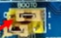

# blue pill serial dimmer
Blue pill STM32F103 example with Arduino framework in platformio

# Flashing
* with stlink, move boot0 jumper to 1 : programming mode

    

* press reset
* set the jumper back

    
